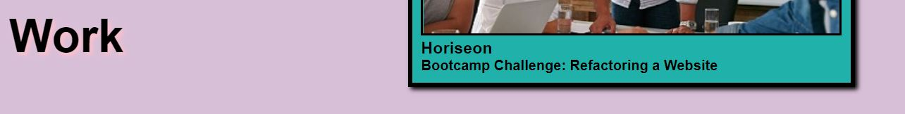
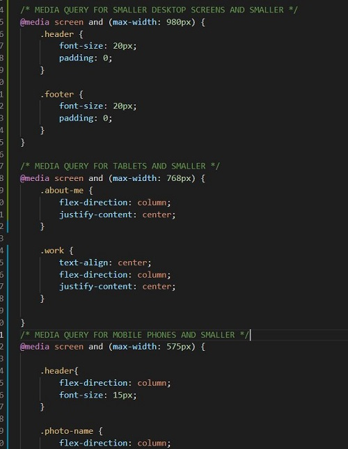

# emichon-portfolio
**E. Michon - Professional Portfolio**

This is a README for the basic and inital build of my online portfolio, show-casing my newly developed coding skills.  As part of a Challenge, we were asked to meet a specific set of criteria in this initial build, mostly centered on advanced CSS skills and RWD (responsive web designs).

**Below are some of the skills I utilized:**

* Flexbox was utilized in the header, footer and sections of the document.

* Flex propeties were assigned to both parent containers and their child items to obtain and simplfy the layout of the portfolio.

* Text-shadow and box-shadow were utilized on headers and images, in black and pink/purple, respectfully:

* Media-queries were used to provide responsive web design, as slightly different formats could be found at the following breaking points: 980px, 768px and 575px:

## Deployed Application
[E. Michon - Portfolio](https://erin-michon.github.io/Challenge1/)